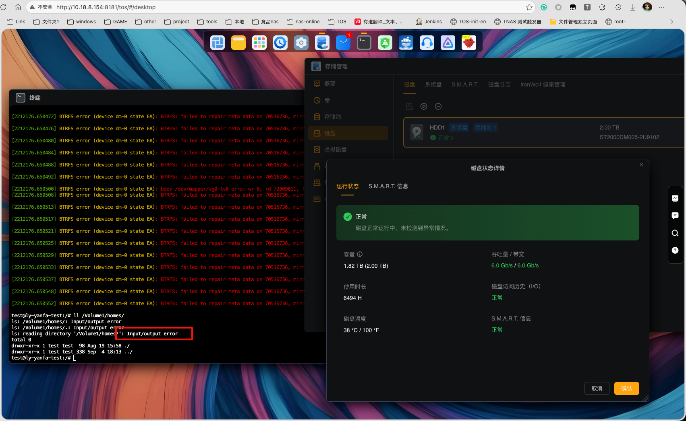

# 10.18.8.154 `vg0-lv0` 全盘 `error target` 事件证据与内网代码分析交接

> 事件日期：2026-09-08～2026-09-09  
> 证据整理日期：2026-09-09  
> 用途：交给可访问 StorageManager 源码的内网 Claude 继续定位  
> 当前状态：NAS 已关机；本文只记录关机前取得的现场证据。后续即使设备重新开机，也不能把重启后的运行时状态当作原始故障现场。

## 1. 一句话结论

故障发生时，`vg0/lv0` 的磁盘上 LVM 元数据仍然定义为正常的线性映射，但内核中正在使用的 device-mapper 表已经变成覆盖整个 LV 的 `error` target，导致所有访问该 LV 的 I/O 都立即失败。`dmsetup remove --force vg0-lv0` 在设备仍被打开时会形成完全相同的状态；现场安装的 `/usr/sbin/storagemanager` 二进制也包含执行这条精确命令的代码路径。

但是，现有留存证据中没有本次事件发生时的命令日志、进程审计或 PID/PPID/argv 记录。因此只能把 StorageManager 列为最主要的代码路径嫌疑，不能声称已经直接证明“本次命令就是 StorageManager 执行的”。

## 2. 结论级别

| 级别 | 结论 | 证据含义 |
|---|---|---|
| 已证实 | 故障时 `vg0-lv0` 的运行时 DM 表为 `0 3885391872 error` | 整个 LV 的每一次新 I/O 都会失败 |
| 已证实 | `/dev/md0` 原始读取成功，而 `/dev/mapper/vg0-lv0` 读取返回 I/O error | 故障边界位于 md0 之上的 DM/LV 映射层 |
| 已证实 | 持久化 LVM 元数据仍为 `striped`、单条带、`pv0` 起始偏移 0，即正常 linear | 不是磁盘上的 LV 定义被永久改成 error segment |
| 已证实 | Btrfs 文件系统仍存在：标签、UUID、空间信息均可识别 | “有文件系统”，但现场因底层 DM error 无法正常读取其内容 |
| 已证实 | StorageManager 二进制包含 `dmsetup remove --force %s` 及相关清理函数 | 该版本 StorageManager 具备制造此状态的能力 |
| 高度吻合 | 对仍处于 open 状态的 DM 设备执行 `dmsetup remove --force` 会用 error table 替换原表 | 与本次“仍挂载、全盘 error、0 dependencies”的现场完全吻合 |
| 高度可能 | StorageManager 或另一个 root 权限本地进程替换了运行时表 | 普通磁盘读错或 Btrfs 自身错误不会把正常 linear 表自动改成全盘 error |
| 尚未证实 | 本次实际执行者就是 StorageManager | 缺少同一时刻的 StorageManager 日志、audit、进程记账或 eBPF/exec 记录 |
| 尚未证实 | CentralizedBackup 触发了存储清理逻辑 | 只证明故障窗口前它在工作，可能持有卷；没有证明它调用 DM 清理 |
| 已排除 | 卷因空间用满导致本次所有 I/O 失败 | Btrfs 仍约有 1.28 TiB 未分配，估算可用约 1.39 TiB |
| 未发现证据 | 当前物理盘介质损坏是直接原因 | SMART 通过、关键坏扇区指标为 0、md0 原始读取成功；不能据此保证磁盘永远无瞬断 |

## 3. 设备身份与证据适用范围

本次历史现场的连接目标如下：

```text
SSH target: 10.18.8.154:9222
account: test (UID/GID 0)
hostname: ly-yanfa-test
kernel: Linux 6.12.63+
kernel build: Tue Mar 31 2026
SSH host fingerprint: SHA256:8F3sNICKxkM34JCHye0AbJLI4OoVUyXFoaCIzLb8eq0
```

注意：公司 NAS 使用动态 IP。`10.18.8.154` 只代表本次事件检查时确认过的目标，不能长期假设该 IP 仍对应同一台设备。

登录密码和其他凭据未写入本文。SSH 密码只做过一次性交互输入，没有保存。由于 `/home/test` 当时只读，未能安装密钥；一次误写入 `/root/.ssh/authorized_keys` 的临时公钥已删除，并得到 `CLEANED_TEMP_KEY` 验证结果。

## 4. 故障现场截图



截图同时显示：

- TOS 存储管理页面把 HDD1 运行状态、磁盘访问历史和 S.M.A.R.T. 显示为“正常”；
- 终端中的 Btrfs 持续报告 `failed to repair meta data`；
- 屏幕可见的设备统计包含 `wr 6, rd 72809011`，说明当时已经累计大量读 I/O 错误；
- `ll /Volume1/homes/` 返回 `Input/output error`；
- 这说明“物理盘健康页正常”和“卷上文件系统可读”不是同一层面的判断。

## 5. 存储拓扑

```text
sda  1.8T  ST2000DM005-2U9102  serial ZFL8A36X
└─sda4
  └─md0  RAID1 [1/1] [U]
    └─vg0/lv0  1.81 TiB
      └─Btrfs /Volume1
```

`/dev/md0` 是只有一个有效成员的单成员 RAID1，现场状态为 clean。它没有冗余容错能力，但当时 raw read 成功。

## 6. 最直接的故障证据

### 6.1 运行时 DM 表已被换成全盘 error

现场读取结果：

```text
# dmsetup table vg0-lv0
0 3885391872 error
```

含义：从 sector 0 开始、长度 3,885,391,872 sectors 的整个逻辑卷都使用 `error` target。它不是某个局部坏块，而是整个运行时映射被配置为直接返回 I/O error。

依赖关系也已经消失：

```text
# dmsetup deps vg0-lv0
0 dependencies
```

正常情况下，该 LV 应为 `linear` target，并依赖 `/dev/md0`。现场的 `0 dependencies` 与纯 `error` target 相符。

### 6.2 故障边界位于 md0 与 LV 之间

现场对比读取：

```text
dd if=/dev/md0 ...
MD0_RAW_READ_OK

dd if=/dev/mapper/vg0-lv0 ...
Input/output error
```

同一条底层路径中，md0 可以读取，而它上面的 LV 立即失败。这是把直接故障点定位到 DM 映射层的关键证据。

### 6.3 持久化 LVM 定义仍正常

现场取得的 LVM 元数据片段：

```text
type = "striped"
stripe_count = 1
stripes = [ pv0, 0 ]
```

LVM 用单条带 `striped` 表示线性 LV。也就是说，磁盘上的 LVM 定义没有被永久改成 error segment；异常只存在于当时的内核运行时表。

这也解释了为什么一次重启或重新激活 LV **可能**恢复为 linear：LVM 可以从正常的持久化元数据重建运行时表。但重启会同时拉起大量服务，未经离线检查就重新访问 Btrfs，不是最受控的恢复方式。

## 7. 它还有没有文件系统

有。现场仍能识别出 Btrfs 文件系统：

```text
Label: TOS_VOL_20260713
UUID: 03015a78-2d30-4f4a-a14b-6c49c6264d73
Used: about 420.24 GiB
Device unallocated: about 1.28 TiB
Estimated free: about 1.39 TiB
Data profile: single
Metadata/System profile: DUP
```

因此不能说“文件系统没了”。准确表述是：

> Btrfs 文件系统元数据仍可识别，`/Volume1` 当时也处于只读挂载状态；但由于下层 `vg0-lv0` 的运行时映射是全盘 error，文件系统实际读写路径被切断，访问 `/Volume1/homes` 返回 I/O error。

此外，Metadata/System 的 `DUP` 两份副本都在同一块物理盘上，并不等同于双盘冗余。

Btrfs 设备统计曾观察到：

```text
write_io_errs       6
read_io_errs        196652764
corruption_errs     0
generation_errs     0
```

后续 `read_io_errs` 因持续重试增长到 5 亿以上，并出现大量 `btrfs-endio-meta` 内核线程占用 CPU。巨量读错是底层 error target 被反复访问的结果；单凭这些计数不能反推 Btrfs 自身先损坏。

## 8. `dmsetup remove --force` 为什么会形成这种状态

Linux `dmsetup` 的行为是：如果对仍被打开的映射设备执行强制删除，设备不能立刻真正移除时，内核会用一个让新 I/O 全部失败的表替换原表。其结果正是一个覆盖全设备的 `error` target。

参考：<https://man7.org/linux/man-pages/man8/dmsetup.8.html>

与本次现场吻合的条件：

1. `vg0-lv0` 仍被挂载或被进程打开；
2. 执行类似 `dmsetup remove --force vg0-lv0` 的操作；
3. 设备不能立即完成普通 remove；
4. 原 linear 表被运行时 error 表替换；
5. Btrfs 和所有上层访问开始持续收到 I/O error；
6. 持久化 LVM 元数据保持不变。

其他命令也可能制造同样的最终表，例如 `dmsetup wipe_table`，或显式 `dmsetup reload` 一个 error table 后再 resume。因此，“当前 table 是 error”可以证明表被替换，却不会记录是哪条命令、哪个 PID 或哪个程序做的。

## 9. StorageManager 相关证据：能证明什么，不能证明什么

### 9.1 已证实的能力证据

现场二进制：

```text
path: /usr/sbin/storagemanager
package: storagemanager
SHA256: 8dd457e9c104692d80d9e4277186e0d9c12ebb5acdfb346090a7dbf0576162fb
```

从该二进制提取到以下原始字符串：

```text
[removeDmDevicesBottomUp]::dmsetup table %s: %s
[removeDmDevicesBottomUp]::%s (table=%s) has holders: %v, removing them first
[removeDmDevicesBottomUp]::lvchange -an %s failed: %v, stderr: %s
[removeDmDevicesBottomUp]::dmsetup remove --force %s (table=%s) failed: %v, stderr: %s
[removeDmDevicesBottomUp]::dmsetup remove --force %s (table=%s) failed (non-fatal for error target): %v, stderr: %s
cleanupVgForRaidStop::unmount %v failed: %v
cleanupVgForRaidStop::lvchange -an %s failed: %v
cleanupVgForRaidStop::dm device %s still exists after remove
[removeCorruptedPool]::will remove corrupted pool %s
[removeCorruptedPool]::will remove corrupted pool %s by deleteStorage(%s)
[removeCorruptedPool]::vg is still occupied by lv, can't delete it
stopCorruptedRaid::stop raid-> can't remove raid %s on attempt %d
```

这些字符串直接证明：该 StorageManager 版本内部存在 `removeDmDevicesBottomUp` 逻辑，并会执行精确形式的 `dmsetup remove --force`；还存在 RAID stop、损坏存储池清理、卸载 VG/LV 等相邻路径。

### 9.2 为什么这还不是本次执行者的直接证据

目前没有发现以下任一种历史记录：

- 含本次时间戳和 `removeDmDevicesBottomUp ... dmsetup remove --force vg0-lv0` 的 StorageManager 日志；
- `auditd/ausearch` 的 `EXECVE`、`SYSCALL` 记录；
- process accounting 的命令执行记录；
- eBPF/execsnoop 捕获；
- 同时包含 executable、PID、PPID、argv 和时间戳的其他日志；
- device-mapper 自身的 actor provenance（DM 表不会保存修改者身份）。

因此证据链目前是：

```text
现场最终状态完全匹配强制 remove
        +
StorageManager 二进制包含精确强制 remove 代码
        +
故障窗口存在存储/备份活动
        -
缺少“该代码在该时刻实际运行”的执行记录
```

最严谨的归责表述应为：

> StorageManager 或另一个 root 权限本地进程很可能替换了 `vg0-lv0` 的运行时映射。StorageManager 是目前最主要、且有二进制代码能力证据支持的候选路径，但 retained evidence 不足以证明它就是本次实际执行者。

### 9.3 什么才算更直接的证据

按证明力从高到低：

1. 事件时刻 audit 日志显示 `/usr/sbin/dmsetup` 的 `EXECVE`，argv 为 `remove --force vg0-lv0`，并能用 PPID/cgroup 追溯到 `/usr/sbin/storagemanager`；
2. StorageManager 自身日志在同一时刻记录函数名、完整命令、VG/LV、table-before/table-after 和成功返回值；
3. eBPF exec 捕获显示进程树与完整参数；
4. 源码调用图加上可复现的故障注入，证明特定输入必然走到该命令；
5. 只有二进制字符串和最终 DM 表，属于强关联证据，但不是历史执行证明。

## 10. 事件时间线

| 时间 | 证据/事件 | 解释 |
|---|---|---|
| 2026-08-14 19:04:53 | 系统启动 | 检查时仍是这一轮 boot |
| 2026-09-08 16:42 左右 | VMware datastore VMDK 查询成功 | CentralizedBackup 工作负载存在 |
| 2026-09-08 17:10 | 打开并查询约 2 TB VMDK | 备份活动证据 |
| 2026-09-08 17:51:36 | CentralizedBackup 服务启动 | 服务包含多个备份进程 |
| 2026-09-08 17:51:37 | `ncbd-vmware` 启动并加载 `/Volume1/@apps/CentralizedBackup` 路径 | 可能成为卷 holder，但不能证明它改表 |
| 2026-09-08 17:52～17:53 | 打开并查询约 40 GB VMDK | 最后一个已知正常工作活动 |
| 2026-09-08 18:06:20 | md0 superblock update time | 接近推定故障窗口，但含义需结合源码/日志确认 |
| 2026-09-08 19:17:35 | 最早留存的应用层 `/Volume1` I/O error | 此时故障已经发生 |
| 2026-09-09 09:06:31 | `/Volume1/homes/test/Desktop` I/O error | SSH 开启前已经存在故障 |
| 2026-09-09 09:21 起 | 桌面路径持续报错 | 故障持续 |
| 2026-09-09 09:38:25～09:38:26 | Web 操作开启 Telnet/SSH | 晚于故障，不能说 SSH 检查导致事件 |

当前可支持的最窄故障窗口：

```text
2026-09-08 17:53:20 ～ 2026-09-08 19:17:35
```

可能接近 `md0` 在 `18:06:20` 的状态更新时间，但这只是时间相关性，不是因果证明。

## 11. CentralizedBackup 证据与边界

现场相关日志路径：

```text
/tmp/vmware-test/vixDiskLib-4064858.log
/tmp/vmware-test/vixDiskLib-4098304.log
```

日志摘录：

```text
Opening file [datastore2] liyong-ubuntu24.04-lvm/liyong-ubuntu24.04-lvm.vmdk
... 4294967296 sectors / 2 TB

Opening file [datastore2] liyong-ubuntu24/liyong-ubuntu24.vmdk
... 83886080 sectors / 40 GB
```

检查时 CentralizedBackup 自 2026-09-08 17:51:36 起处于 active，进程包括：

```text
ncbd-hyperv
ncbd-pc
FileServer
ncbd-vmware
```

能够得出的结论：中央备份在故障窗口前正在访问 VM 磁盘，并很可能持有 `/Volume1` 上的文件或路径。如果另一个存储清理路径此时对 LV 做强制 remove，“设备仍 open”正是转成 error target 的必要背景之一。

不能得出的结论：中央备份主动执行了 `dmsetup remove --force`，或者中央备份本身触发了 StorageManager 的损坏池/RAID stop 流程。现有日志没有这条因果链。

## 12. 容量与磁盘健康

### 12.1 不是容量用满

```text
Btrfs used: about 420.24 GiB
Device unallocated: about 1.28 TiB
Estimated free: about 1.39 TiB
```

因此不能把本次“所有 I/O 立即失败”归因于 ENOSPC。

### 12.2 SMART 没有证明物理介质故障

```text
Model: ST2000DM005-2U9102
Serial: ZFL8A36X
Power-on hours: about 6494
Temperature: 38 C
SMART overall-health: PASSED
Reallocated_Sector_Ct: 0
Reported_Uncorrect: 0
Current_Pending_Sector: 0
Offline_Uncorrectable: 0
UDMA_CRC_Error_Count: 0
SMART error log: No Errors Logged
```

有一个历史 `Command_Timeout` raw 值 `0 0 1`，但没有足够证据把它认定为本次故障原因。SMART 正常也不能排除瞬时掉盘、电源/链路抖动或软件误判；它只说明未发现当前介质坏扇区证据。

## 13. 为什么历史执行者证据缺失

- 检查时 journal 只保留到 2026-09-09 10:16 以后；
- Btrfs 错误洪泛导致更早 journal 被轮转；
- `/tmp/log/StorageManager` 只剩 `access.20260907.log`；
- 2026-09-08 的 StorageManager 执行日志未保留；
- 2026-09-08 Nginx access 记录未保留；
- `auditd`、`ausearch`、process accounting 不可用或事先未启用；
- TOS `module_log` 没有 2026-09-08 的存储操作事件；
- `ter_disk_log` 没有 2026-09-08 的 HDD remove/add 记录。

日志缺失本身不能证明没有执行，只说明无法在事后把最终状态归责到具体 PID。

## 14. 建议的受控修复方案（尚未执行）

> 以下步骤只是交接建议，本次没有执行。操作前必须重新确认设备 hostname、磁盘序列号、md/LVM 拓扑和当前状态。若 NAS 已重启，先保存重启后证据，不要直接照抄旧设备名操作。

### 14.1 停止 holders

先停止 CentralizedBackup 及所有实际持有 `/Volume1` 的服务/进程，再确认 holder：

```bash
fuser -vm /Volume1
findmnt -S /dev/mapper/vg0-lv0
```

### 14.2 正常卸载，不用 lazy/force

按从子挂载到父挂载的顺序卸载，包括 `/var/subvols/...`、`/home`，最后 `/Volume1`。不要用 lazy unmount 或 forced unmount 掩盖 holder。

确认 DM open count 为 0。若残留设备仍存在，优先普通 remove，禁止再次使用 `--force`。

### 14.3 从持久化 LVM 元数据重建映射

```bash
lvchange -an vg0/lv0
lvchange -ay --activationmode complete vg0/lv0
```

验证：

```bash
dmsetup table vg0-lv0
dmsetup deps vg0-lv0
```

预期结果必须是 `linear` target，并重新依赖 `/dev/md0`，而不是 `error`。

### 14.4 先做离线只读检查

```bash
btrfs check --readonly /dev/mapper/vg0-lv0
```

不要从 `btrfs check --repair` 开始。后者可能造成不可逆修改。

### 14.5 顶层只读挂载并优先备份重要数据

```bash
mkdir -p /mnt/volume1-recovery
mount -t btrfs -o ro,nologreplay,subvolid=5 \
  /dev/mapper/vg0-lv0 /mnt/volume1-recovery
```

先验证并复制重要 VM 备份数据，再评估是否恢复正常读写挂载。

## 15. 下一次复现时应立即增加的直接取证

### 15.1 审计 exec

在测试环境复现前启用能记录 `dmsetup` 和 `lvchange` 执行的审计，至少捕获：时间、exe、完整 argv、PID、PPID、UID、cgroup/container 信息。事件完成后按 PID/PPID 还原进程树。

### 15.2 StorageManager 日志必须补充

每次清理前后记录：

- correlation ID；
- 上游 API/gRPC/RAID/disk 事件；
- PID、PPID、调用函数；
- VG/LV/DM 名称；
- `dmsetup table` before/after；
- open count、holders、mount points；
- md 状态与成员状态；
- unmount/lvchange/remove 的完整参数、返回码和 stderr；
- timeout 的起止时间；
- 是否选择 `--force` 以及选择理由；
- 失败后的 rollback/reactivation 结果。

### 15.3 故障洪泛时保护关键日志

为 StorageManager 操作日志使用独立、限速且可持久保留的日志文件，避免被 Btrfs I/O error 洪泛挤出 journal。

## 16. 交给内网 Claude 的源码分析任务

下面整段可以直接复制给能够读取 StorageManager 源码的内网 Claude：

---

你现在可以访问 TOS StorageManager 的完整源码。请基于以下已经确认的现场事实做源码级根因分析，不要把推测写成事实。

### 已确认现场事实

1. 故障设备为单成员 RAID1：`sda4 -> md0 -> vg0/lv0 -> Btrfs /Volume1`。
2. `/dev/md0` raw read 成功；`/dev/mapper/vg0-lv0` raw read 返回 `Input/output error`。
3. 运行时 `dmsetup table vg0-lv0` 为：

   ```text
   0 3885391872 error
   ```

4. `dmsetup deps vg0-lv0` 为 `0 dependencies`。
5. 持久化 LVM metadata 仍为单条带 linear：

   ```text
   type = "striped"
   stripe_count = 1
   stripes = [ pv0, 0 ]
   ```

6. Btrfs 仍可识别：label `TOS_VOL_20260713`，UUID `03015a78-2d30-4f4a-a14b-6c49c6264d73`；空间未满。
7. 安装的 `/usr/sbin/storagemanager` SHA256 为：

   ```text
   8dd457e9c104692d80d9e4277186e0d9c12ebb5acdfb346090a7dbf0576162fb
   ```

8. 二进制包含以下字符串：

   ```text
   [removeDmDevicesBottomUp]::dmsetup table %s: %s
   [removeDmDevicesBottomUp]::%s (table=%s) has holders: %v, removing them first
   [removeDmDevicesBottomUp]::lvchange -an %s failed: %v, stderr: %s
   [removeDmDevicesBottomUp]::dmsetup remove --force %s (table=%s) failed: %v, stderr: %s
   [removeDmDevicesBottomUp]::dmsetup remove --force %s (table=%s) failed (non-fatal for error target): %v, stderr: %s
   cleanupVgForRaidStop::unmount %v failed: %v
   cleanupVgForRaidStop::lvchange -an %s failed: %v
   cleanupVgForRaidStop::dm device %s still exists after remove
   [removeCorruptedPool]::will remove corrupted pool %s
   [removeCorruptedPool]::will remove corrupted pool %s by deleteStorage(%s)
   [removeCorruptedPool]::vg is still occupied by lv, can't delete it
   stopCorruptedRaid::stop raid-> can't remove raid %s on attempt %d
   ```

9. CentralizedBackup 在推定故障窗口前活动，`ncbd-vmware` 使用 `/Volume1/@apps/CentralizedBackup`，可能持有卷；但没有证据证明它调用了 DM 清理。
10. 推定故障窗口是 `2026-09-08 17:53:20` 到 `19:17:35`，`md0` superblock update time 为 `18:06:20`。
11. 没有保留下来的执行日志、audit 或进程记账，因此当前不能直接证明本次命令由 StorageManager 执行。

### 请完成以下分析

1. 全局搜索并逐一定位：

   - `removeDmDevicesBottomUp`
   - `cleanupVgForRaidStop`
   - `removeCorruptedPool`
   - `stopCorruptedRaid`
   - `dmsetup remove --force`
   - `waitForDmDevicesGone`
   - `waitForDeviceRelease`
   - `umountAllLvByVg`
   - `activateVg`
   - `MountCorruptedPool`

2. 给出从磁盘/RAID 事件、启动恢复流程、HTTP/gRPC handler 到 `removeDmDevicesBottomUp` 和 `dmsetup remove --force` 的完整调用图。
3. 列出所有可能对 `vg0/lv0` 调用强制 remove 的条件、状态机分支、超时分支和错误分支。
4. 检查设备仍 mounted/open 时的处理：如何发现 mount、holder、open count；unmount 失败后是否继续；错误是否被降为 non-fatal。
5. 确认是否在等待超时后直接使用 `--force`；评估应否改用普通 remove、`--deferred`，或放弃清理并保持原映射。
6. 检查 `/dev/md0` 恢复/重新出现后的 rollback 和 LV reactivation 逻辑，确认 error target 是否可能长期残留。
7. 从源码解释：为什么持久化 LVM 元数据保持 linear，但 live DM table 会变成 error。
8. 将源码条件与本次时间线、CentralizedBackup holder 场景对应，指出哪些路径吻合、哪些缺证据。
9. 找出当前日志缺口，并提出精确新增日志字段：PID、PPID、完整命令、VG/LV、table-before/table-after、holders、mount points、RAID state、correlation ID、返回码和 stderr。
10. 给出最小安全修复方案，重点防止在 mounted/open 的文件系统上执行会留下 error target 的强制 remove。
11. 设计回归测试：单元测试、集成测试和 fault-injection，至少覆盖备份进程持有文件、unmount 失败、RAID 瞬断又恢复、等待超时、StorageManager 重启和系统重启。
12. 严格分开输出“源码已确认事实”“与现场吻合的可能路径”“仍未验证的假设”。

### 输出格式

请返回：

1. 根因结论与可信度；
2. 完整调用图；
3. 精确的源码文件、函数和行号；
4. 按时间/状态排列的故障序列；
5. 最小补丁方案或 diff；
6. 单元、集成、故障注入测试用例；
7. 应新增的日志与审计点；
8. 仍需从设备补采的证据。

不要因为二进制中存在命令字符串就直接认定本次已经执行。必须给出能够连接上游事件到该命令的源码条件和可复现路径。

---

## 17. 最终判定

当前可以确定的是“怎么坏的”：`vg0-lv0` 的正常运行时映射被全盘 error target 替换，使现存 Btrfs 文件系统失去底层 I/O。

当前不能最终确定的是“谁在那个时刻执行的”：StorageManager 具备精确匹配的代码，是第一候选；但缺少历史执行记录，不能越过证据边界做唯一归责。下一步必须依赖内网源码调用图、同条件复现，以及预先启用的 exec/StorageManager 审计，才能把“高度可能”升级为“直接证明”。

## 18. 证据完整性与移交说明

### 18.1 内网只收到本文时是否足够

本文已经把现场可用的关键文本证据、时间线、结论边界、修复建议和源码分析提示词写成自包含内容。即使内网 Claude 看不到原 NAS、外网电脑或截图，也可以仅根据本文开始做源码调用图分析。

截图属于辅助佐证，其可见内容已经在第 4 节逐项转录。截图文件 SHA256：

```text
2412620B4D3DC7DC7CB139FAD117A7DCE7187E8D836FA47FD73B37EF93919887
```

### 18.2 原始程度说明

- 本文代码块中明确给出的 `dmsetup table`、`dmsetup deps`、LVM metadata、二进制字符串、设备身份、Btrfs 身份、SMART 指标和日志摘录，均来自关机前已采集结果。
- `dd if=/dev/md0 ...` 中的 `...` 表示原始采集摘要没有保留下完整块大小/计数参数；可确认的是该次 md0 raw read 成功并输出 `MD0_RAW_READ_OK`。不要把省略号还原成猜测参数。
- `dd if=/dev/mapper/vg0-lv0 ...` 同理，只能确认对应读取返回 `Input/output error`。
- 时间线中的“左右”“约”“推定窗口”表示精度边界，不应在源码报告中被扩写成精确触发时刻。
- `read_io_errs` 在不同采集时刻持续增长；截图中的 `72809011`、后续命令中的 `196652764` 以及最终超过 5 亿并不矛盾，而是错误重试洪泛的不同时间截面。
- 没有保留下来的原始日志不能由源码推理补造。源码只能证明某路径存在或满足条件时会执行，不能单独证明历史现场确实走过该路径。

### 18.3 重启后证据的使用规则

如果 NAS 之后重新开机并恢复可访问：

1. 先重新确认 hostname、SSH 主机指纹、磁盘型号/序列号，防止动态 IP 指向其他设备；
2. 把所有新采结果标记为“重启后状态”；
3. 保存 boot ID、启动时间、`dmsetup table/deps/status/info`、`lvs -a -o +devices`、`mdadm --detail`、`findmnt`、Btrfs superblock 和新一轮日志；
4. 不用重启后恢复为 linear 的结果否认本次现场曾出现 error target；
5. 不用重启后新生成的日志声称它记录了 2026-09-08 的执行者；
6. 在完成只读检查和重要数据备份前，不进行写挂载或 `btrfs check --repair`。
